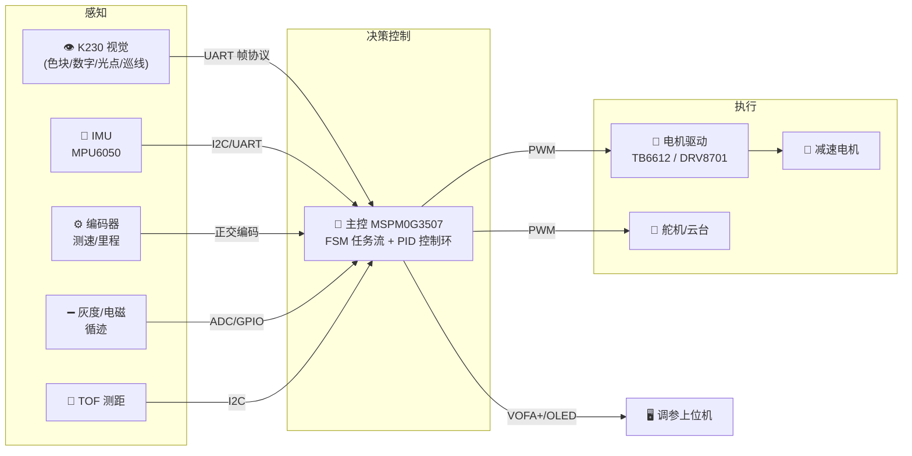
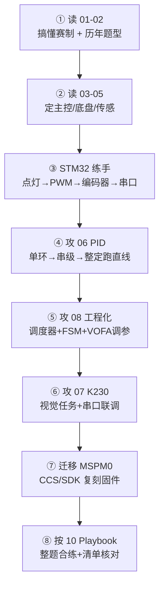

# 📖 电赛小车 · 电控软件知识库（总览 MOC）

> [!info] 这是什么
> 这是一支备战**全国大学生电子设计竞赛（NUEDC）省赛 / 赛区赛 / TI 杯**「小车 / 运动控制 / 循迹追踪」类赛题的队伍的**技术知识库**。
> 本人负责 **软件 / 电控**：主控固件、软硬件联调、PID 等控制算法，以及与 **K230 视觉**回传数据的通信对接。
> 全库为 **Obsidian 兼容**格式（frontmatter + `[[双链]]` + 标签），从 `00` 开始按编号阅读即可。

---

## 🎯 项目定位与我的职责

| 维度 | 说明 |
|---|---|
| 赛事 | NUEDC 省级 / 赛区赛 / TI 杯（**2026 是双数年「小年」**，主攻省赛，非国赛）|
| 赛题方向 | 控制类 / 小车类：循迹、运动目标追踪、送药小车、双车通信等 |
| 主控（主力）| **TI MSPM0G3507**（Cortex-M0+，模拟外设丰富，近两年电赛主流）|
| 主控（练手/备用）| **STM32**（F103 / F407 / G431，CubeMX+HAL）|
| 视觉 | **嘉楠 Kendryte K230（CanMV）**，UART 回传坐标/偏差/目标 |
| 我的主线 | 主控固件 + 电机闭环（编码器 + PID）+ 传感融合 + **K230 串口协议** + 调参工程化 |

---

## 🧩 系统框图（典型小车）

---

## 🗺️ 知识库地图

### 一、赛事与赛题（先搞清楚要打什么）
- [[01-赛事概况与赛制流程|01 赛事概况与赛制流程]] — 大小年、组队、题目分类、72h 流程、封箱与综合测评
- [[02-历年小车与控制类赛题|02 历年小车与控制类赛题]] — 2011→2024 逐题解析，命题规律与「视觉+控制」趋势

### 二、硬件方案（搭什么车）
- [[03-主控选型-MSPM0与STM32|03 主控选型 · MSPM0 与 STM32]] — MSPM0G3507 vs STM32 外设/开发环境/取舍
- [[04-电机驱动与执行机构|04 电机驱动与执行机构]] — 编码器电机、TB6612/DRV8701、PWM、麦轮运动学、测速
- [[05-感知传感器选型|05 感知传感器选型]] — 灰度/电磁循迹、IMU 姿态解算、TOF、里程计

### 三、软件与算法（我的主战场）
- [[06-PID及衍生控制算法|06 PID 及衍生控制算法]] — 位置式/增量式/串级/模糊 PID、前馈、LQR、滤波、整定 + C 代码
- [[07-K230视觉与主控通信|07 K230 视觉与主控通信]] — CanMV 视觉任务 + UART 帧协议 + 双端代码
- [[08-软件架构与调试工程化|08 软件架构与调试工程化]] — 分层架构、时间片调度器、FSM、VOFA+/JustFloat 调参

### 四、实战与资源（怎么赢）
- [[09-开源资源与备赛经验|09 开源资源与备赛经验]] — GitHub 仓库、B站教程、复盘帖、团队分工与节奏
- [[10-典型赛题实战Playbook与Checklist|10 典型赛题实战 Playbook 与 Checklist]] — 送药/追踪/循迹打法、技术栈组合、三张清单
- [[资源链接总表|📑 资源链接总表]] — 全库 222 条去重外链统一索引

---

## 📚 推荐学习 / 备赛路径

> [!tip] 给软件/电控负责人的最短主线
> **编码器测速 → 速度环 PID → 位置/转向串级 PID → 循迹偏差控制 → K230 串口协议联调 → 用 VOFA+ 整定 → FSM 串任务流**。
> 先在 STM32 上跑通这条链路（资料多、上手快），再整体迁移到 MSPM0G3507。

---

## ✅ 下一步待办（建议）

- [ ] 确认本省 2026 省赛 / TI 杯方案：是否开控制/小车题、**是否允许摄像头**（决定 K230 能否上场）→ 见 [[01-赛事概况与赛制流程]]
- [ ] 采购清单：MSPM0G3507 开发板 ×2、STM32 练手板、编码器电机 ×4、TB6612/DRV8701、IMU、灰度/电磁模块、K230、电源/电池 → 见 [[04-电机驱动与执行机构]]、[[05-感知传感器选型]]
- [ ] 搭建固件工程模板（分层 + 调度器 + 串口 + PID 模块）→ 见 [[08-软件架构与调试工程化]]
- [ ] 设计并固化 **K230 ↔ 主控 UART 帧协议**（帧头/功能码/数据/校验/帧尾）→ 见 [[07-K230视觉与主控通信]]
- [ ] 预制代码库：PID、滤波、电机驱动、编码器、协议解析（赛前模块化备好）→ 见 [[09-开源资源与备赛经验]]

> 需要我接着干哪一项，直接说，我可以开始建 **工程代码框架 / 协议头文件 / 采购清单表格**。

---

## 🏷️ 标签体系

- `#电赛/赛事` `#电赛/赛题`：赛制与题目
- `#电赛/硬件`：主控、电机、传感器
- `#电赛/算法` `#电赛/控制`：PID 与控制
- `#电赛/视觉` `#电赛/通信`：K230 与协议
- `#电赛/软件` `#电赛/架构`：工程化
- `#电赛/资源` `#电赛/实战`：资源与实战

> [!note] 用法
> 用 Obsidian 打开本文件夹作为 Vault；点击 `[[双链]]` 跳转，按 `Ctrl/Cmd+点击` 在新面板打开；用右侧反向链接面板看笔记间关系；标签面板按主题筛选。
