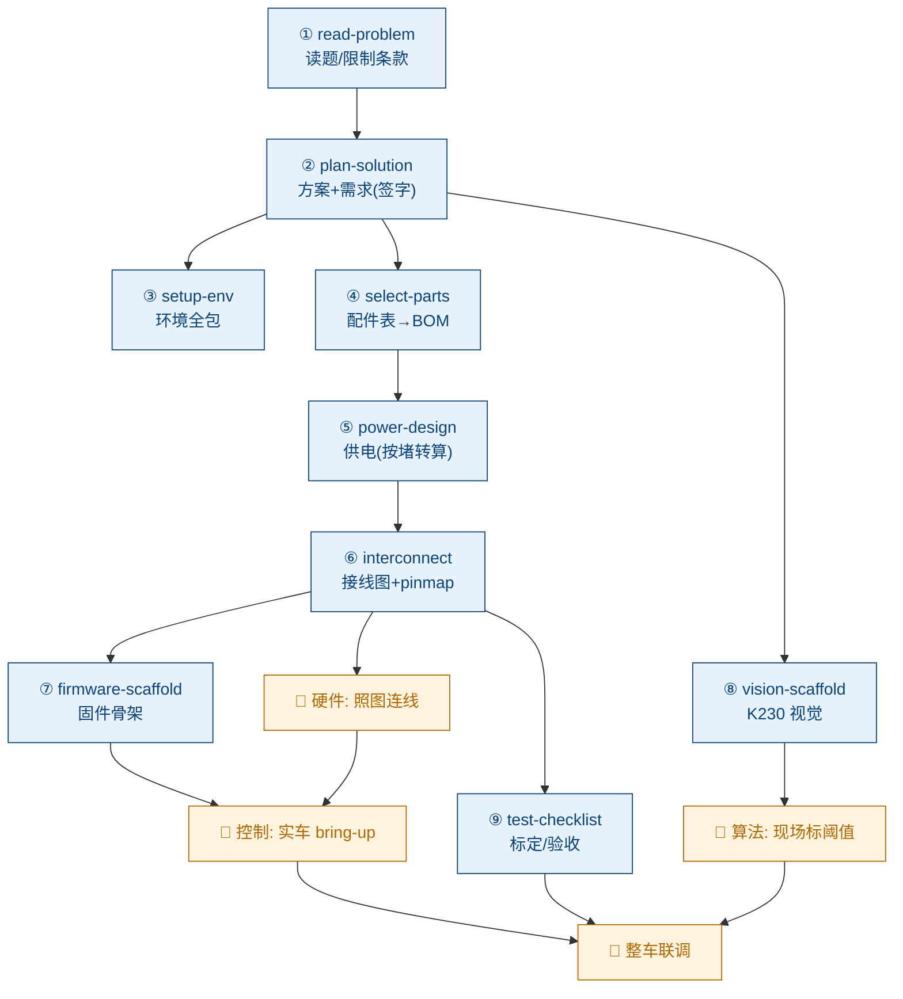
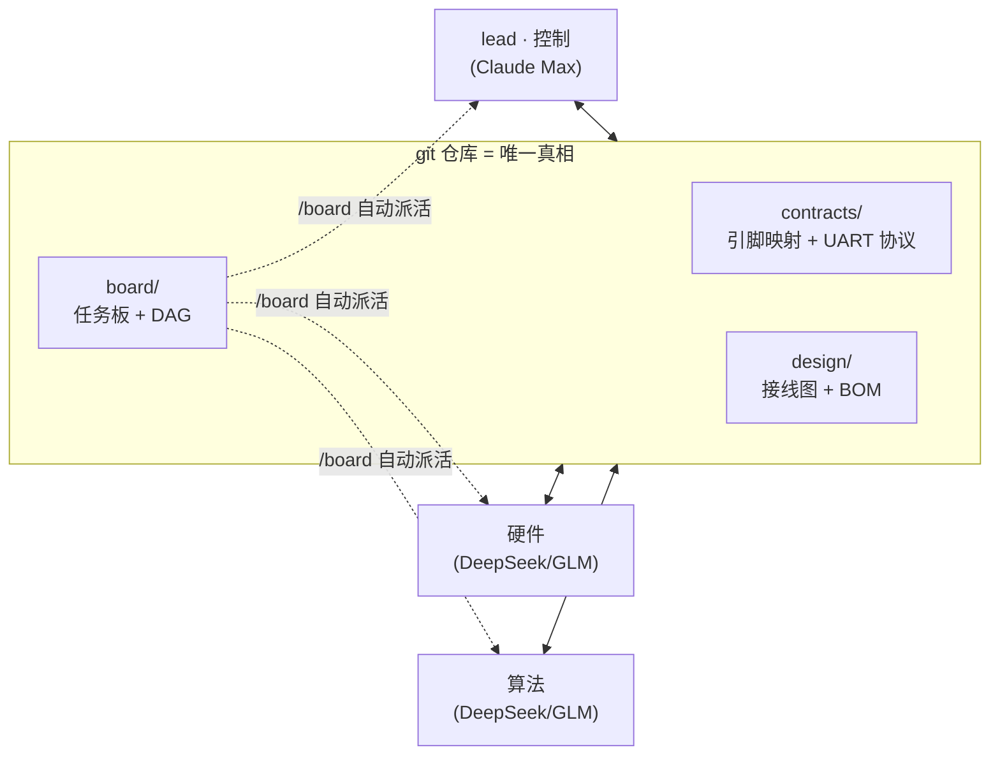

<h1 align="center">⚡ elec-race</h1>

<p align="center">
  <b>NUEDC 小车电控设计智能体</b> · Claude Code 驱动的「读题 → 选型 → 接线图 → 固件」门控流水线
</p>

<p align="center">
  
  
  
  
  
</p>

> **一句话**：把当年比赛题目丢进去，AI 自动**选型、画模块接线图、出固件/视觉骨架**；你照图连线、现场整定。
> 三人团队（硬件 / 控制 / 算法）靠 **git + 任务板**自动协同、自动交接。
> **全程由 Claude Code 驱动**：推理交给 Claude Code 背后的大模型（lead 用 Claude，队友可接 DeepSeek / GLM 等 API）；**我们写的 skill 与工具代码本身不直接调用大模型 API**，确定性工具是纯 Python。
> 前提需要保证 **Claude Code** 里面的 API 有一个是多模态长文本的，作为核心路由节点。

---

## ✨ 这是什么 / 为什么

全国大学生电子设计竞赛（NUEDC）现场分秒必争：3 个人（硬件、程序控制、算法视觉）要在限时内把一台小车从无到有做出来。本仓库把其中**可以被 AI 接管的"起草层"**——选型、引脚映射、接线图、固件脚手架、环境清单——做成一套 **Claude Code skill 流水线**，让人把省下的时间花在**只有人能在真车上做的事**（连线、焊接、PID 整定、视觉阈值标定）。

设计哲学（基于对 LLM 硬件能力的调研）：

- **AI 当集成商，不当芯片设计师**。从零合成 IC 级原理图是 LLM 最差的环节（HWE-Bench 2026 最强模型板级原理图通过率仅 **8.15%**，"缺乏物理直觉"）。所以本系统只做**模块级集成**——把已验证模块拼起来、出接线图，规避会"静默毁板"的环节。
- **正确性交确定性门，不靠"模型觉得对"**。引脚冲突、协议一致性、供电余量都由脚本判定；`"检查通过" ≠ "设计对"`，关键处保留人工逐网核对。
- **知识库只作参考语料**：引脚说明 / 赛事章程 / 金奖经验，skill 用 `Read` 查阅，不当库存、不当需求来源。

---

## 🗺️ 设计流水线（9 段，每段带确定性门 + 人工门）



<sub>蓝 = skill 自动起草（确定性门 + 人工门把关）　橙 = 人在真车上的活</sub>

---

## 👥 三人并行协同（git 背书任务板 · 自动派活）

三台机器、三个 Claude 会话**不能直接通信**，只能靠 git 仓库协同。`board/` 把"谁干什么、干到哪、下一步派给谁"变成可提交、可拉取的任务文件——**干完一个任务，自动按流水线 DAG 给下游 lane 派活**。



- **模型异构无碍**：整合在文件层，git 不管文件是哪个模型写的。读 PDF/手册等多模态任务归 lead；队友 DeepSeek/GLM 干代码 lane，错误交编译/`pinmux_check` 等确定性门。
- **`/board`**：`git pull` → 看派给本 lane 的就绪任务 → 干 → `done`（自动交接）→ `push`。近实时靠 `/loop 5m /board` 或 `tools/watch.sh`。
- 详见 [board/README.md](board/README.md)。

---

## 🚀 快速开始

```bash
# 1) 装 host 依赖（运行 skill 工具用；无 LLM 依赖）
sh tools/bootstrap.sh

# 2) 一键自测，确认环境 OK（9 项全绿）
sh tools/selftest.sh

# 3) 初始化任务板
python3 tools/board.py init

# 4) 比赛时：把当年题目/配件表丢进去
#    inputs/problem/     <- 官方题目 PDF/文本
#    inputs/partslist/   <- 主办方配件表
```

然后在 Claude Code 里：

- `/elec-design` —— 看全流程、当前该做哪一步。
- `/board` —— 看派给本 lane 的任务、领取、完成、自动交接。
- 各阶段：`/read-problem` `/plan-solution` `/setup-env` `/select-parts` `/power-design` `/interconnect` `/firmware-scaffold` `/vision-scaffold` `/test-checklist`。

## 🤝 三人先读这里

跨团队协作先看 [`contracts/README.md`](contracts/README.md)。其中规定了 K230 与 MSPM0/STM32 的 UART 协议唯一来源、生成方式、功能码与联调规则；软件、视觉不得各自手改协议生成文件。

> 每台机器在仓库根建 `.elec-lane`（写 `lead`/`硬件`/`控制`/`算法`，不入库）声明本机角色。

---

## 🧩 Skill 目录

| Skill | 作用 | 输出 | 门 |
|---|---|---|---|
| `elec-design` | 顶层编排，判断现在该做哪一步、安排三 lane 并行 | — | — |
| `read-problem` | 解析当年题目（含限制条款）→ 结构化需求 | `design/problem.yaml` | — |
| `plan-solution` | 据题目 + 金奖经验定方案、推需求 | `design/solution.md` | 人工签字 |
| `setup-env` | 三 lane 环境/工具链清单 + 版本锁定 + 烧录调试 | `env/` | — |
| `select-parts` | 从主办方配件表选材，缺口 `jlc_search` 现查 | `design/bom.csv` | 人工批 BOM |
| `power-design` | 多路隔离供电（电机按堵转电流算） | `design/power.{md,yaml}` | `power_budget` + 人工 |
| `interconnect` | 模块互联 → 引脚映射 → 接线图 | `design/wiring.svg` + `contracts/pinmap.yaml` | `pinmux_check` + 逐网核对 |
| `firmware-scaffold` | 4 层固件骨架（调度/FSM/PID/协议/VOFA） | `firmware/` | 编译 + init 核对 |
| `vision-scaffold` | K230 CanMV 视觉骨架（用同源协议发帧） | `vision/` | 语法 + 现场标阈值 |
| `test-checklist` | 按题目功能裁剪的现场标定/验收清单 | `design/test_plan.md` | — |
| `board` | git 任务板：领任务 / 完成 / 自动派活 | `board/` | — |

---

## 🔒 确定性门 —— 为什么可信

不靠"模型觉得对"，每个关键环节都有可复跑的脚本判定（`sh tools/selftest.sh`，9 项全绿）：

| 门 | 工具 | 验什么 |
|---|---|---|
| 协议两端一致 | `gen_protocol.py` | 从 `protocol.yaml` 生成 C + Python，签名哈希比对，杜绝控制/算法漂移 |
| **跨语言契约** | `tests/test_protocol_xlang.py` | C 帧与 Python 帧**逐字节相同**；Python 解 C 的帧正确 |
| 引脚 | `pinmux_check.py` | 引脚冲突 / 功能非法 / 外设超限 → FAIL |
| 供电 | `power_budget.py` | 按**堵转电流**算每轨负载、稳压欠流 → FAIL（防掉电复位） |
| 固件中间件 | `examples/sending-medicine-2023/firmware/tests/host_test.c` | PID / 调度器 / 协议状态机在主机真编译真跑断言 |

> 这正是 8.15% 哲学的落地：把 AI 用在它擅长的"起草"，把正确性钉死在确定性门和人工门上。

---

## 📂 仓库结构

```
elec_race/
├── .claude/skills/      11 个 skill（流水线 + 任务板）
├── contracts/           ★神圣契约：UART 协议(protocol.*) + 引脚映射 + MCU 能力表
├── board/               git 任务板（一任务一文件 + DAG 自动派活）
├── lib/modules/         可复用 known-good 模块接法块
├── tools/               确定性脚本：gen_protocol/pinmux_check/power_budget/render_wiring/jlc_search/board/selftest
├── env/                 三 lane 环境/工具链清单（版本锁定）
├── inputs/              ↩ 每年投喂：题目 + 配件表
├── design/              ↪ 产物：problem/solution/bom/power/wiring/harness/test_plan
├── firmware/  vision/   控制 / 算法 lane 产出区
├── examples/            完整走查样例（送药小车，端到端跑通）
└── kb/                  📚 知识库：00~10 + 资源链接总表（Obsidian Vault，见下）
```

---

## 📐 跑通的样例：智能送药小车

`examples/sending-medicine-2023/` 是一条端到端走查（题目 → 方案 → BOM → 供电 → 引脚映射 → **接线图** → 固件 → 视觉 → 验收清单），全部经 `selftest.sh` 验证：

- [`solution.md`](examples/sending-medicine-2023/solution.md) 方案+签字需求表 · [`bom.csv`](examples/sending-medicine-2023/bom.csv) 选材
- [`wiring.svg`](examples/sending-medicine-2023/wiring.svg) 接线图（31 条网络） · `harness.md` 接线表
- `firmware/`（可主机编译的 PID/调度器 + 协议往返测试） · `vision/`（K230 CanMV） · `test_plan.md`

---

## ⚠️ 诚实的边界

- **MCU 引脚能力表 `verified:false`**：逐脚复用是代表性占位，`pinmux_check` 只保证"逻辑自洽"，真实引脚须用 TI SysConfig / 数据手册核实。
- **固件只验了可移植部分**（PID / 调度器 / 协议）；驱动/应用层是经语法检查的脚手架，真编译需在 CCS + MSPM0 SDK。
- **跨机器协同是 pull 驱动**：无实时推送通知（故有轮询）；任务板是协作式、非强制。
- 样例题面为历年改写，非官方逐字版。

---

## 📚 知识库（Obsidian Vault）

仓库同时是一个备赛知识库（skill 用 `Read` 查阅作参考语料）。用 Obsidian「打开文件夹作为库」获得双链/反链/关系图谱，从 [`kb/00-总览MOC.md`](kb/00-总览MOC.md) 读起。

| # | 笔记 | 内容 |
|---|---|---|
| 00 | [总览 MOC](kb/00-总览MOC.md) | 首页：定位、系统框图、学习路径 |
| 01 | [赛事概况与赛制流程](kb/01-赛事概况与赛制流程.md) | 大小年、组队、题目分类、72h 流程 |
| 02 | [历年小车与控制类赛题](kb/02-历年小车与控制类赛题.md) | 2011→2024 逐题解析与趋势 |
| 03 | [主控选型 MSPM0 与 STM32](kb/03-主控选型-MSPM0与STM32.md) | 外设对比、开发环境、取舍 |
| 04 | [电机驱动与执行机构](kb/04-电机驱动与执行机构.md) | 电机、驱动芯片、PWM、麦轮、测速 |
| 05 | [感知传感器选型](kb/05-感知传感器选型.md) | 循迹/电磁、IMU、TOF、里程计 |
| 06 | [PID 及衍生控制算法](kb/06-PID及衍生控制算法.md) | 位置/增量/串级/模糊 PID、整定、C 代码 |
| 07 | [K230 视觉与主控通信](kb/07-K230视觉与主控通信.md) | CanMV 视觉 + UART 帧协议 + 双端代码 |
| 08 | [软件架构与调试工程化](kb/08-软件架构与调试工程化.md) | 分层、调度器、FSM、VOFA+ 调参 |
| 09 | [开源资源与备赛经验](kb/09-开源资源与备赛经验.md) | GitHub、B站、复盘、分工与节奏 |
| 10 | [典型赛题实战 Playbook 与 Checklist](kb/10-典型赛题实战Playbook与Checklist.md) | 打法、技术栈组合、三张清单 |
| — | [资源链接总表](kb/资源链接总表.md) | 全库 222 条去重外链索引 |

---

## 🛠️ 技术栈

主控 **TI MSPM0G3507**（练手/备用 STM32 F103/F407/G431）· 视觉 **嘉楠 K230 CanMV**（UART 回传）· 控制 位置/增量/串级 PID · 驱动器 Claude Code（skill + 子代理 + git；推理走 Claude Code 背后的模型——lead 用 Claude、队友可接 DeepSeek/GLM API；工具层纯 Python、无 LLM 依赖）。

依赖：Python3 + `PyYAML`/`requests`/`pdfplumber`；系统 `graphviz`（接线图）、C 编译器（固件主机测试）、`git`。

## 📄 License

[MIT](LICENSE)。知识库内容由多源网络调研整合，赛题信息以官方当年通知为准。
